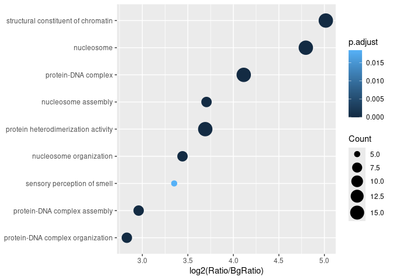
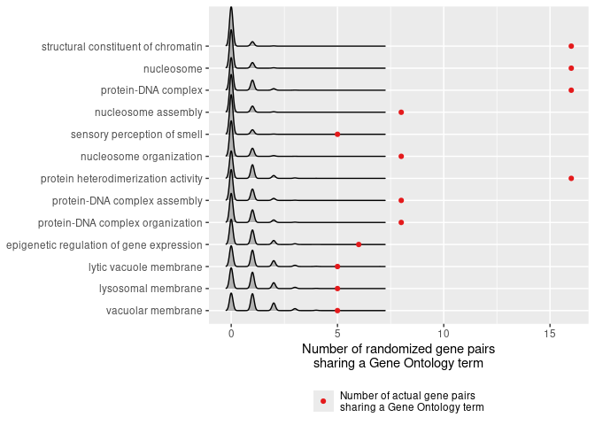

<!-- README.md is generated from README.Rmd. Please edit that file -->

# GO-a-GO

<!-- badges: start -->
<!-- badges: end -->

GO-a-GO annotates functional terms that are overrepresented in a given
set of gene pairs. The enrichment of Gene Ontology terms is calculated
from a permutation test for overrepresentation of gene pairs that are
associated with a common term.

## Installation

You can install the development version of GO-a-GO from
[GitHub](https://github.com/) with:

``` r
# install.packages("devtools")
devtools::install_github("ajank/GOaGO")
```

## Example

Let us run GO-a-GO on a set of gene pairs associated with human
GM12878-specific chromatin loops. We can inspect a few rows of the
dataset:

``` r
library(GOaGO)
#> 

tail(genePairsGM12878Specific)
#> Key: <loopID>
#>    loopID chrom1   start1     end1 centroid1 distance_to_TSS1 geneID1 chrom2
#>     <int> <char>    <int>    <int>     <int>            <int>   <int> <char>
#> 1:   9384   chrX 55740000 55750000  55745000                0   10325   chrX
#> 2:   9390   chrX 57610000 57620000  57615000                0  158586   chrX
#> 3:   9418   chrX 73830000 73835000  73832500                0   51132   chrX
#> 4:   9423   chrX 77160000 77170000  77162500                0     538   chrX
#> 5:   9434   chrX 80060000 80070000  80065000                0  254065   chrX
#> 6:   9434   chrX 80060000 80070000  80065000                0  254065   chrX
#>      start2     end2 centroid2 distance_to_TSS2 geneID2 loop_distance pairID
#>       <int>    <int>     <int>            <int>   <int>         <int>  <int>
#> 1: 56750000 56760000  56755000             4016  442454       1010000    806
#> 2: 57940000 57950000  57940000             2933    7789        325000    807
#> 3: 74140000 74145000  74142500              286  340533        310000    808
#> 4: 77350000 77360000  77357500                0    5230        195000    809
#> 5: 80450000 80460000  80455000                0    6451        390000    810
#> 6: 80450000 80460000  80455000                0   79366        390000    811
```

The column names ending with `1` and `2` refer to the first and second
loop anchors, respectively. The essential columns are: `geneID1` and
`geneID2` (gene identifiers from a database of choice), `pairID`
(identifier of a gene pair), and `loopID` (identifier of a chromatin
loop). As some loop anchors overlapped Transcription Start Sites of
multiple genes, the dataset contains all gene combinations for these
loops.

When running GO-a-GO, we should specify that gene identifiers are from
the ENTREZ database, and use the Bioconductor `org.Hs.eg.db` package as
the source of Gene Ontology annotations for human genes, taking all
three subontologies (Biological Process, Molecular Function, and
Cellular Component). We will run 10,000 permutations, and use the
default *p*-value cutoff of 0.05 with Benjamini-Hochberg correction:

``` r
library(org.Hs.eg.db)

# set the number of CPU threads to use
library(BiocParallel)
options(MulticoreParam=MulticoreParam(workers=2))

goago <- GOaGO(genePairsGM12878Specific, keyType = "ENTREZID",
               OrgDb = org.Hs.eg.db, ont = "ALL", numPermutations = 10000L)
```

The overrepresented GO terms are as follows:

``` r
print(goago@result)
#>   ONTOLOGY         ID                         Description Count       Ratio
#> 1       BP GO:0034728             nucleosome organization     8 0.009864365
#> 2       BP GO:0006334                 nucleosome assembly     8 0.009864365
#> 3       BP GO:0065004        protein-DNA complex assembly     8 0.009864365
#> 4       CC GO:0000786                          nucleosome    16 0.019728730
#> 5       MF GO:0030527 structural constituent of chromatin    16 0.019728730
#> 6       MF GO:0046982 protein heterodimerization activity    16 0.019728730
#> 7       BP GO:0007608         sensory perception of smell     5 0.006165228
#> 8       MF GO:0023023         MHC protein complex binding     4 0.004932182
#>        BgRatio pvalue p.adjust     qvalue
#> 1 0.0008122072  0e+00 0.000000 0.00000000
#> 2 0.0006606658  0e+00 0.000000 0.00000000
#> 3 0.0012011097  0e+00 0.000000 0.00000000
#> 4 0.0007096178  0e+00 0.000000 0.00000000
#> 5 0.0006099877  0e+00 0.000000 0.00000000
#> 6 0.0013130703  0e+00 0.000000 0.00000000
#> 7 0.0005589396  2e-04 0.022925 0.01918421
#> 8 0.0003787916  2e-04 0.022925 0.01918421
```

Note that some of the *p*-values have the value of zero, which means
that for all the randomizations fewer gene pairs were associated with a
given term than in the input dataset.

We can plot the overrepresented GO terms as a dotplot. The x-axis shows
the log<sub>2</sub> fold change of the fraction of gene pairs sharing
the given term; `Ratio` is the fraction in the input gene pairs, while
`BgRatio` is the fraction in permuted ones. Color indicates the adjusted
*p*-value:

``` r
DotPlot(goago)
```



Note that by default only the terms associated with at least 5 gene
pairs are shown; you can change this by setting `minTermPairs` to any
other value.

We can also see the sampling distributions of numbers of gene pairs
sharing each GO term, obtained for the randomized gene pairs. From these
distributions, empirical *p*-values were calculated:

``` r
RidgePlot(goago)
#> Picking joint bandwidth of 0.115
```


