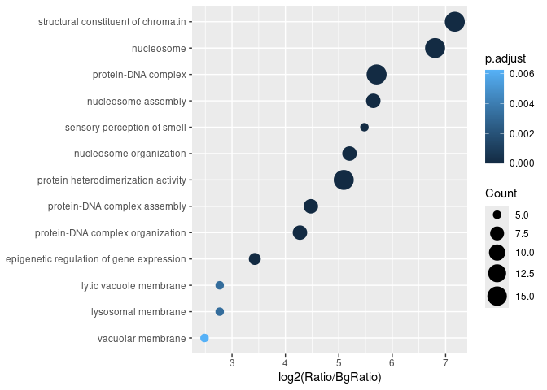

<!-- README.md is generated from README.Rmd. Please edit that file -->

# GO-a-GO

<!-- badges: start -->

<!-- badges: end -->

GO-a-GO annotates functional terms that are overrepresented in a given
set of gene pairs. The enrichment of Gene Ontology terms is calculated
from a permutation test for overrepresentation of gene pairs that are
associated with a common term.

## Installation

You can install the development version of GO-a-GO from
[GitHub](https://github.com/) with:

``` r
# install.packages("devtools")
devtools::install_github("ajank/GOaGO")
```

## Example

Let us run GO-a-GO on a set of gene pairs associated with human
GM12878-specific chromatin loops. We can inspect a few rows of the
dataset:

``` r
library(GOaGO)
#> 

data("genePairsGM12878Specific")
head(genePairsGM12878Specific, 10)
#>     loopID chrom1    start1      end1 centroid1 distance_to_TSS1 geneID1 chrom2
#>      <int> <char>     <int>     <int>     <int>            <int>  <char> <char>
#>  1:     19  chr10 103600000 103605000 103598750                0   30819  chr10
#>  2:     23  chr10 103985000 103990000 103987500                0   83401  chr10
#>  3:     24  chr10 103985000 103990000 103990000                0   83401  chr10
#>  4:     28  chr10 104595000 104600000 104600000                0    1586  chr10
#>  5:     37  chr10 105725000 105730000 105725833                0    9748  chr10
#>  6:    117  chr10 131260000 131270000 131270000                0    4255  chr10
#>  7:    120  chr10  13200000  13205000  13204166                0   55388  chr10
#>  8:    124  chr10 134140000 134150000 134145000                0   80313  chr10
#>  9:    124  chr10 134140000 134150000 134145000                0  282974  chr10
#> 10:    126  chr10 134340000 134350000 134345000             1352    3632  chr10
#>        start2      end2 centroid2 distance_to_TSS2 geneID2 loop_distance
#>         <int>     <int>     <int>            <int>  <char>         <int>
#>  1: 103830000 103835000 103831250             4876   79803        232500
#>  2: 104160000 104165000 104162500             4040    5662        175000
#>  3: 104235000 104240000 104237500             7085   79847        247500
#>  4: 105000000 105005000 105000000              643  729020        400000
#>  5: 105880000 105885000 105880833                0  119392        155000
#>  6: 131900000 131910000 131905000                0  119437        635000
#>  7:  13340000  13345000  13344166                0    5264        140000
#>  8: 135070000 135080000 135075000             9497     101        930000
#>  9: 135070000 135080000 135075000             9497     101        930000
#> 10: 135060000 135070000 135065000             8592   27287        720000
```

The column names ending with `1` and `2` refer to the first and second
loop anchors, respectively. The essential columns are: `geneID1` and
`geneID2` (gene identifiers from a database of choice), `pairID`
(identifier of a gene pair), and `loopID` (identifier of a chromatin
loop). As some loop anchors overlapped Transcription Start Sites of
multiple genes, the dataset contains all gene combinations for these
loops.

When running GO-a-GO, we should specify that gene identifiers are from
the Entrez database, and use the Bioconductor `org.Hs.eg.db` package as
the source of Gene Ontology annotations for human genes, taking all
three subontologies (Biological Process, Molecular Function, and
Cellular Component). We will run the default 10,000 permutations, and
also use the default *p*-value cutoff of 0.05 with Benjamini-Hochberg
correction:

``` r
library(org.Hs.eg.db)

# set the number of CPU threads to use
library(BiocParallel)
options(MulticoreParam = MulticoreParam(workers = 2))

goago <- GOaGO(genePairsGM12878Specific,
    keyType = "ENTREZID", OrgDb = org.Hs.eg.db, ont = "ALL"
)
#> Warning in uniqueGenePairs(genePairs): removing 6 duplicated gene pair(s)
#> Warning in uniqueGenePairs(genePairs): removing 30 gene pair(s) containing the
#> same gene twice
```

We can inspect the overrepresented GO terms:

``` r
head(goago@result)
#>   ONTOLOGY         ID
#> 1       BP GO:0034728
#> 2       BP GO:0006334
#> 3       BP GO:0040029
#> 4       BP GO:0071824
#> 5       BP GO:0065004
#> 6       BP GO:0019886
#>                                                                         Description
#> 1                                                           nucleosome organization
#> 2                                                               nucleosome assembly
#> 3                                          epigenetic regulation of gene expression
#> 4                                                  protein-DNA complex organization
#> 5                                                      protein-DNA complex assembly
#> 6 antigen processing and presentation of exogenous peptide antigen via MHC class II
#>   Count       Ratio      BgRatio FoldEnrichment pvalue p.adjust qvalue
#> 1     8 0.010322581 0.0002703226       38.18616      0        0      0
#> 2     8 0.010322581 0.0001983226       52.04945      0        0      0
#> 3     6 0.007741935 0.0007245161       10.68566      0        0      0
#> 4     8 0.010322581 0.0005188387       19.89555      0        0      0
#> 5     8 0.010322581 0.0004468387       23.10136      0        0      0
#> 6     2 0.002580645 0.0000196129      131.57895      0        0      0
```

Note that some of the *p*-values have the value of zero, which means
that for all the randomizations fewer gene pairs were associated with a
given term than in the input dataset.

We can plot the overrepresented GO terms as a dotplot. The x-axis shows
the log<sub>2</sub> fold change of the fraction of gene pairs sharing
the given term; `Ratio` is the fraction in the input gene pairs, while
`BgRatio` is the fraction in permuted ones. Color indicates the adjusted
*p*-value:

``` r
DotPlot(goago)
```



Note that by default only the terms associated with at least 5 gene
pairs are shown; you can change this by setting `minTermPairs` to any
other value.

We can also see the sampling distributions of numbers of gene pairs
sharing each GO term, obtained for the randomized gene pairs. From these
distributions, empirical *p*-values were calculated:

``` r
RidgePlot(goago)
#> Picking joint bandwidth of 0.0717
```


